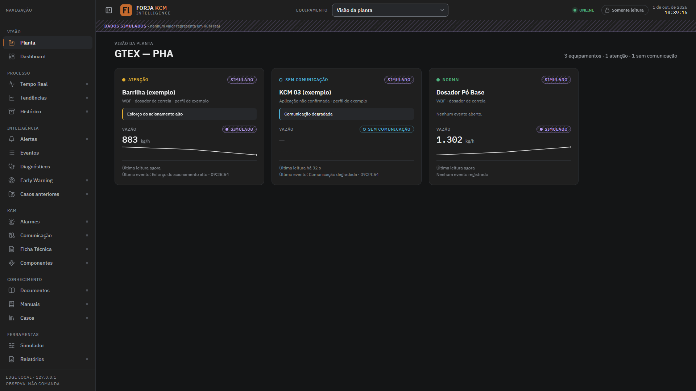
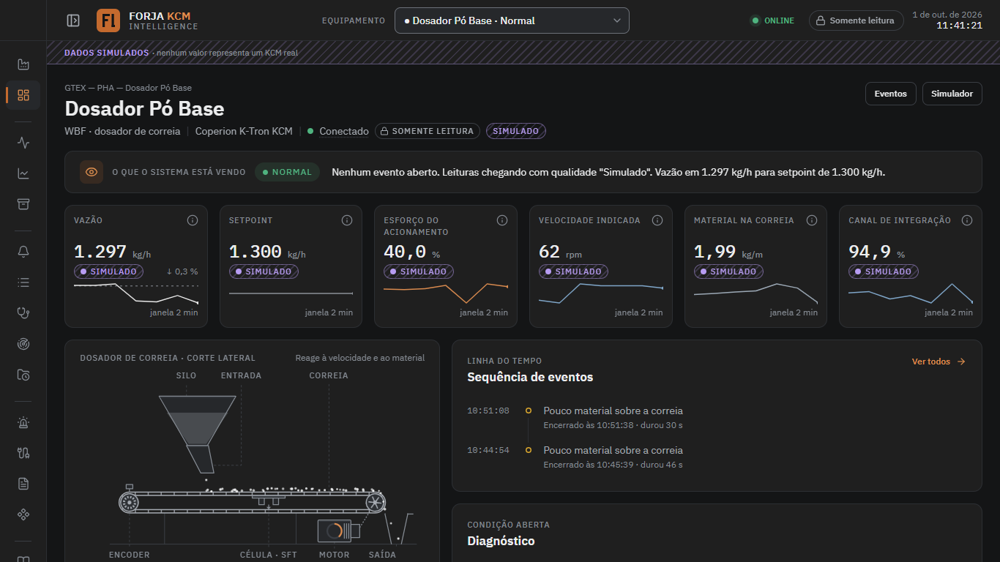
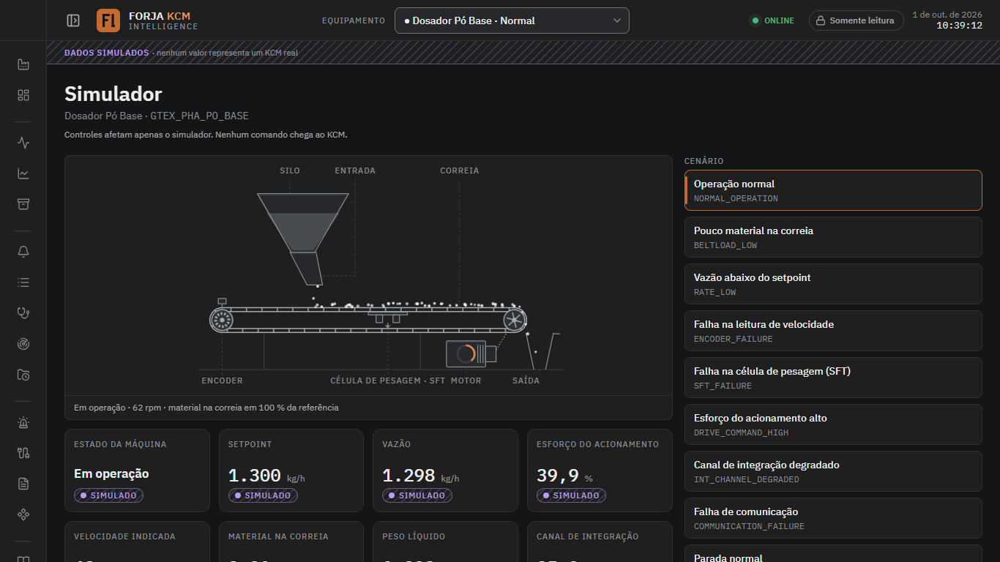
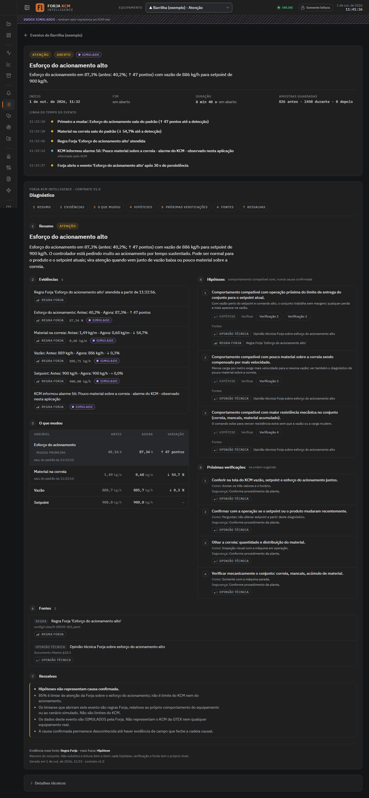

# Forja KCM Intelligence

> **O KCM controla a dosagem. A Forja observa o KCM, entende o comportamento e ajuda a manutenção a diagnosticar.**

Software industrial **somente leitura** para dosadores com controlador **Coperion K-Tron KCM**. Ele lê o controlador, guarda o histórico, detecta o que mudou e quando mudou, e entrega para a manutenção um diagnóstico rastreável: o que mudou, hipóteses compatíveis, o que verificar primeiro, fontes e ressalvas.

Não é um supervisório. Não comanda nada: não dá RUN ou STOP, não altera setpoint, não reseta alarme, não calibra. Isso é garantido pela própria construção do código e verificado por testes.

Produto da **Forja Lógica** (automação e otimização de processos). Primeiro alvo: um dosador de correia (aplicação WBF) em planta industrial. Tudo que depende da máquina real permanece marcado como `UNKNOWN` até validação em campo. **Hoje o sistema roda com dados simulados**, claramente identificados em todas as telas.

---

## Estado atual (01/10/2026)

| Fase | Conteúdo | Situação |
|---|---|---|
| A | Fundação: domínio, configuração, contratos entre módulos | concluída |
| A1 | Núcleo: drivers, simulador WBF, historian SQLite, aquisição, eventos, diagnóstico, API, CLI | concluída |
| B | Design system e casca da interface (menu, cabeçalho, seletor de equipamento) | concluída |
| C | Visão da planta e dashboard do equipamento | concluída |
| D | Dosador animado e página do simulador | concluída |
| E | Tendências, histórico e tempo real | próxima |
| F | Alertas, aviso antecipado e casos anteriores | planejada |
| G | Comunicação: assistente de descoberta, teste somente leitura, editor de mapeamento | planejada |
| H–P | Multi-equipamento, drivers Modbus TCP e EtherNet/IP, saúde e logs, relatórios e backup, instalador Windows, validação em campo | planejadas |

Telas ainda não construídas aparecem na interface como **"Em desenvolvimento · próxima etapa: …"**. Nenhum botão falso.

**Verificação:** 572 testes do núcleo e 38 testes de interface em navegador real (4 tamanhos de tela, zero requisição externa). Lint e verificação de tipos sem erro.

---

## Telas

| Visão da planta | Dashboard do equipamento |
|---|---|
|  |  |

| Simulador com dosador animado | Diagnóstico em 7 seções |
|---|---|
|  |  |

Responsivo até 375 px (celular), com menu em gaveta e toque mínimo de 44 px: [docs/screenshots/celular.png](docs/screenshots/celular.png).

---

## O que o sistema responde

Um supervisório responde "o que está acontecendo". A Forja responde:

- O que mudou? Quando começou? O que mudou **primeiro**?
- O que aconteceu antes do alarme? Quais variáveis mudaram juntas?
- Isso já aconteceu antes? Quais hipóteses são compatíveis?
- O que a manutenção deve verificar primeiro? Que evidência sustenta cada hipótese?

O diagnóstico é um documento JSON versionado (contrato v1.0) com sete seções fixas: **Resumo, Evidências, O que mudou, Hipóteses, Próximas verificações, Fontes, Ressalvas**. Hipótese nunca é apresentada como causa: o texto é sempre "comportamento compatível com…", e cada hipótese, verificação e fonte carrega o próprio nível de evidência (documentado pelo fabricante, documento da máquina, confirmado em campo, observado em campo, regra Forja, opinião técnica, hipótese).

---

## Arquitetura

```
Dosador → KCM → interface Host/Anybus → Forja Edge (PC da planta)
                                             │
                                   Aquisição somente leitura
                                             │
                               Normalização por mapeamento externo
                                             │
                                     Historian (SQLite)
                                             │
                                Motor de eventos determinístico
                                             │
                                  Diagnóstico (JSON v1.0)
                                             │
                                API local + interface em localhost
```

- **PLC e SCADA não são fonte** nem fallback: a leitura é direta do KCM pela interface Host/Anybus configurada na máquina.
- **Read-only por construção:** a porta de driver só tem `connect / disconnect / read / health / capabilities`. A classe base recusa, na definição, qualquer subclasse que tente adicionar escrita. Não existe rota de comando na API nem botão de comando na interface. Testes de contrato varrem o código procurando operações de escrita e falham se encontrarem.
- **Nada da planta em código:** protocolo, IP, registradores, assemblies, KGR, bits de status, alarmes e limites vivem em arquivos de configuração (`config/`, `knowledge/`), com classificação de evidência e o literal `UNKNOWN` onde ainda não se sabe.
- **Qualidade do dado sempre visível:** `GOOD`, `SIMULATED`, `UNCERTAIN`, `STALE`, `COMM_ERROR`, `BAD`. Valor antigo nunca aparece como atual. Buraco de leitura é buraco no gráfico, nunca interpolação.
- **Offline-first:** sem CDN, sem fontes remotas, sem script externo. Escuta só em `127.0.0.1` por padrão.
- **Multi-equipamento desde o início:** falha de um KCM não derruba a leitura dos outros.

Stack: Python 3.14, FastAPI, Pydantic v2, SQLite (dois arquivos, SQL à mão, migrações numeradas), SSE para tempo real, pymodbus (fase J). Interface: Vite + Svelte 5 + TypeScript, compilada para arquivos estáticos servidos pelo próprio backend. Fontes IBM Plex (OFL), ícones Lucide (ISC), gráficos uPlot (MIT), todos embutidos.

---

## Como rodar (Windows)

Pré-requisitos: Python 3.13 ou 3.14 e Node 20 ou superior.

```powershell
python -m venv .venv
.\.venv\Scripts\python.exe -m pip install -e . -r requirements.lock.txt
cd frontend; npm ci; npm run build; cd ..        # gera src/forja/ui/dist
.\.venv\Scripts\forja.exe run                    # abre em http://127.0.0.1:8765/app (ou na próxima porta livre)
```

Outros comandos:

```powershell
.\.venv\Scripts\python.exe -m pytest -q -m "not e2e"     # testes do núcleo (~1 min)
.\.venv\Scripts\python.exe -m pytest -q                  # tudo, inclusive testes de tela (Edge local, ~4 min)
.\.venv\Scripts\forja.exe diagnose --demo BELTLOAD_LOW   # diagnóstico em texto, a partir do simulador
.\.venv\Scripts\forja.exe diagnose --json --demo BELTLOAD_LOW   # mesmo diagnóstico no contrato JSON v1.0
.\.venv\Scripts\forja.exe doctor                         # verifica o ambiente, sem rede
```

Roteiro de demonstração: **Planta → Dosador Pó Base → Simulador → "Pouco material na correia"** → em cerca de um minuto o painel muda para ATENÇÃO → **Abrir diagnóstico** → imprimir.

---

## Estrutura do repositório

```
config/        perfis de equipamento, mapeamentos, regras, alarmes, motivos de parada (YAML)
knowledge/     biblioteca de diagnóstico, casos de campo, textos em português
src/forja/     domain · config · infra · drivers · normalization · acquisition · historian · events · diagnostics · api · service · tools
frontend/      interface (Vite + Svelte 5 + TypeScript); build vai para src/forja/ui/dist
tests/         unit · integration · contract (read-only, fronteiras, schema) · e2e (Playwright) · fixtures
docs/          auditoria inicial, decisões (ADR), contratos entre módulos, referências, capturas de tela
doc/           Documento Mestre do projeto (fonte de contexto; não é manual do fabricante)
```

Documentos para quem vai continuar o trabalho: [`CLAUDE.md`](CLAUDE.md) (regras e estado), [`docs/auditoria/2026-09-30_auditoria_inicial.md`](docs/auditoria/2026-09-30_auditoria_inicial.md) (plano e decisões), [`docs/adr/README.md`](docs/adr/README.md) (registro de decisões), [`docs/contracts/`](docs/contracts/) (contratos entre módulos).

---

## Política de conhecimento

Toda informação técnica no projeto leva uma classificação: `FACT`, `OFFICIAL_DOC`, `MACHINE_DOC`, `FIELD_CONFIRMED`, `FIELD_OBSERVED`, `FORJA_RULE`, `TECHNICAL_OPINION`, `HYPOTHESIS`, `UNKNOWN`. Hipótese não vira fato sem evidência. Um alarme só tem significado para a combinação exata de fabricante, controlador, aplicação e versão de software em que foi observado ou documentado; nunca existe "código de alarme universal".

Este software não promete prever falhas nem evitar paradas. O objetivo é reduzir o tempo entre o início de uma condição anormal, a sua identificação e a intervenção técnica, e preservar a memória técnica do equipamento.

---

## Licenças de terceiros

IBM Plex Sans e Mono (SIL OFL 1.1), uPlot (MIT), Lucide (ISC), Svelte (MIT), FastAPI (MIT), pymodbus (BSD-3). Os textos completos estão em [`frontend/licenses/`](frontend/licenses/) e na tela **Sobre** do sistema.

Código do produto: © Forja Lógica. Todos os direitos reservados.
